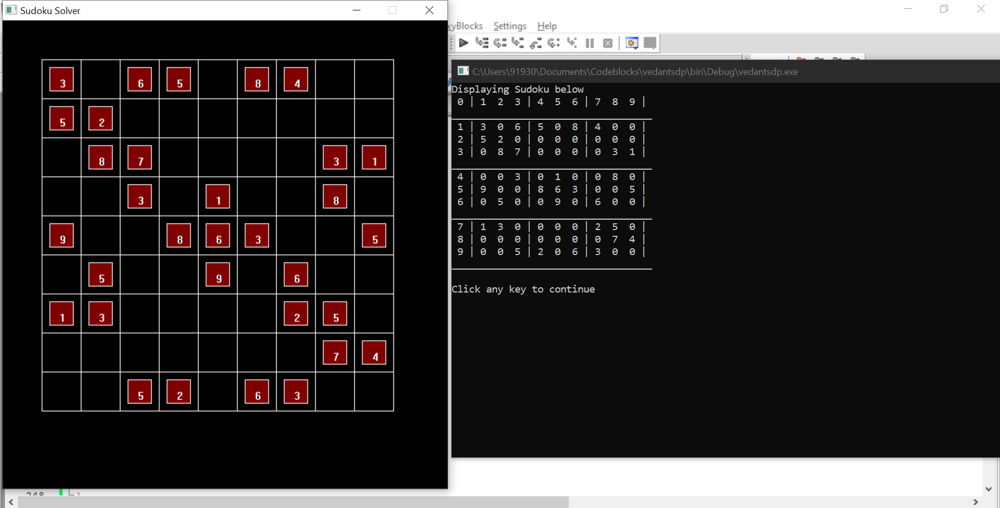
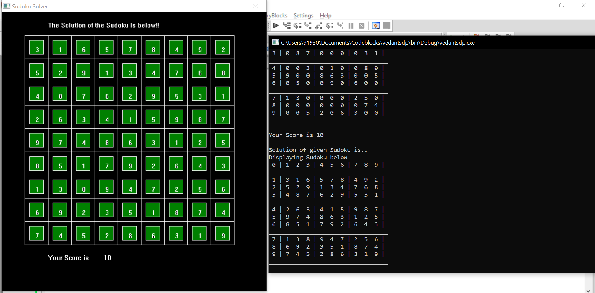

 - User can play a sudoku given and try to fill the empty cells with appropriate value and can try to solve it.

 - After that program algorithm will solve the sudoku step by step and after solving whole sudoku user will get score of correct matched cells.
 

 - main.cpp file should be run on codeblocks as graphics.h is used.
 

